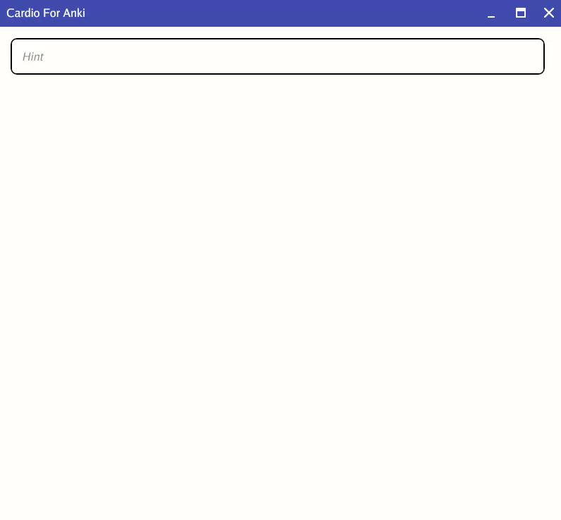
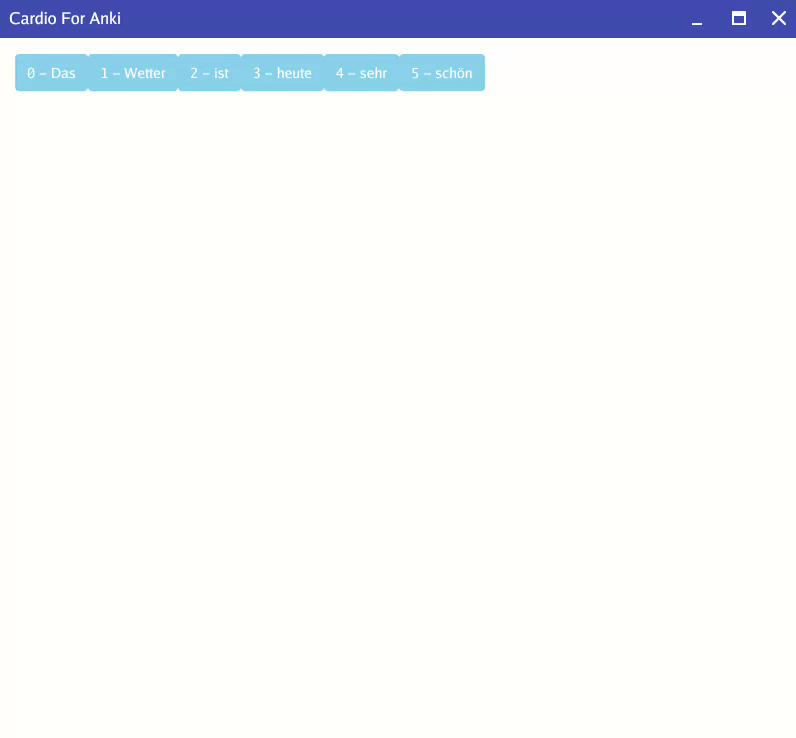
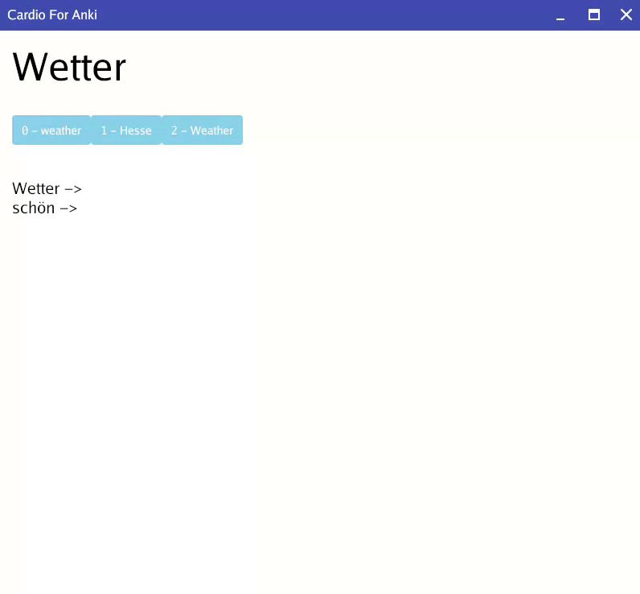
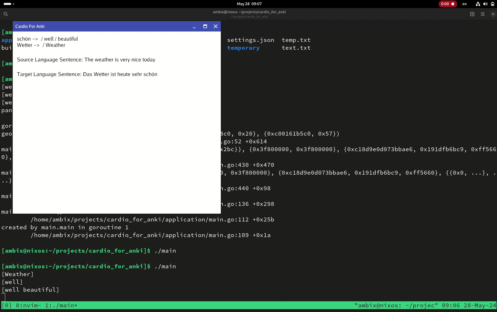

# cardio_for_anki
A card creation tool for language learning and Anki. Not currently released.

# Minimal Working Product

# Stage One - Input Sentence.


# Stage Two - Mark Unknown Words. 


# Stage Three - Pick Equivalent Target Language Translations.



# Stage Four - Make Card.



# Setup
Currently you just need a deepl api key. You must use the free version at the moment. It goes in `keys.json` file at the root of the project, which should look like this.

```
{
	"deepl" : "{Your Key here}"
}
```
